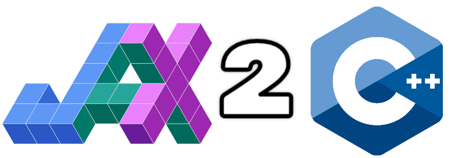

<div align="center">
</img>
</div>

# jax-to-cpp
Generate HLO with JAX then execute in C++. This removes the overhead of Python at runtime while maintaining its flexibility at design-time. Soon I'll add full training loops for ultrafast convergence.

## Getting Started

Recursively clone this repository to get all the necessary files (including the [XLA submodule](https://github.com/openxla/xla/tree/dd7b496b6d082bfeda230332ea8e418e8cf3ca78)):
```
git clone --recursive https://github.com/hayden-donnelly/jax-to-cpp.git
```

Change into the cloned directory:
```
cd jax-to-cpp
```

Build the Docker image:
```
docker-compose build
```

Start the Docker container:
```
docker-compose up -d
```

Open a shell in the container:
```
docker-compose exec j2cpp bash
```

Generate a simple HLO module with JAX:
```
python3 scripts/generate_hlo.py
```

Build the ``execute_hlo`` target with Bazel (this might take a while at first, but the results will be cached for next time):
```
bazel build //:execute_hlo
```

Run the executable you just built:
```
bazel-bin/execute_hlo
```